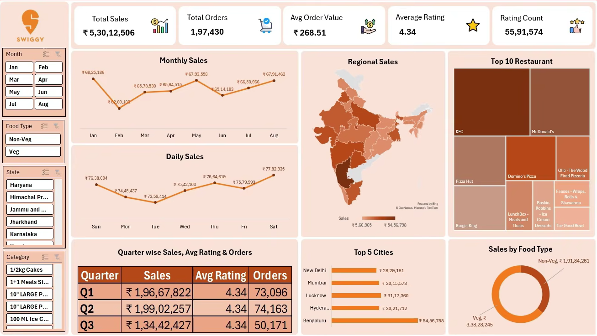

# Swiggy Sales Analytics Dashboard

# Project Overview

The Swiggy Sales Analytics Dashboard is an interactive Power BI project designed to analyze sales performance, customer orders, restaurant rankings, food preferences, and regional trends across India.

This dashboard helps stakeholders monitor key business metrics, identify high-performing locations and restaurants, and make data-driven decisions to improve overall business performance.

# Objectives  
Analyze overall sales performance.
Track order volume and customer ratings.
Identify top-performing restaurants and cities.
Compare Veg and Non-Veg food sales.
Monitor monthly, daily, and quarterly trends.
Provide actionable business insights through interactive visualizations.

# Dashboard Snapshot 

Add your dashboard screenshot here.

Images/dashboard-overview.png

# Key Performance Indicators (KPIs) 
Metric	Value
Total Sales	₹5,30,12,506
Total Orders	1,97,430
Average Order Value	₹268.51
Average Rating	4.34
Rating Count	55,91,574

# Dashboard Features  
Sales Analysis
Monthly Sales Trend
Daily Sales Trend
Quarter-wise Sales Performance
Geographic Analysis
State-wise Sales Distribution
Regional Sales Map
Restaurant Analysis
Top 10 Restaurants by Sales
Restaurant Performance Comparison
Customer Insights
Average Customer Rating
Rating Count Analysis
Food Analysis
Veg vs Non-Veg Sales Distribution
Category-wise Performance Analysis
Interactive Filters
Month
Food Type
State
Category

# Key Business Insights 
1. Sales Performance
Total revenue exceeded ₹5.3 Crores.
Sales remained relatively stable across months with noticeable peaks in May and August.
2. City Performance
Bengaluru generated the highest sales among all cities.
Mumbai, Hyderabad, Lucknow, and New Delhi were among the top contributors.
3. Restaurant Performance

Top-performing restaurants include:

KFC
McDonald's
Pizza Hut
Domino's Pizza
Burger King
4. Food Preferences
Both Veg and Non-Veg categories contributed significantly to total sales.
Non-Veg orders generated slightly higher revenue compared to Veg orders.
5. Customer Satisfaction
Average customer rating remained consistently high at 4.34, indicating strong customer satisfaction.
🛠️ Tools & Technologies Used
Power BI
Power Query
DAX
Microsoft Excel
Data Visualization
Business Intelligence

# Project Structure 
swiggy-sales-analytics-dashboard
│
├── Dashboard
│   └── Swiggy_Sales_Dashboard.pbix
│
├── Dataset
│   └── Swiggy_Data.xlsx
│
├── Images
│   └── dashboard-overview.png
│
├── README.md
└── LICENSE

# Business Problem  

Food delivery platforms generate large volumes of sales and customer data daily. Without proper analysis, identifying trends, customer preferences, and high-performing regions becomes difficult.

This dashboard addresses that challenge by providing:

Real-time business monitoring
Restaurant performance tracking
Customer behavior analysis
Regional sales insights
Strategic decision-making support

# Future Improvements 
Customer Segmentation Analysis
Delivery Time Performance Tracking
Profitability Dashboard
Forecasting & Predictive Analytics
Real-Time Data Integration

# Dashboard Preview 

 # Author 
 
Ajay Kumar
